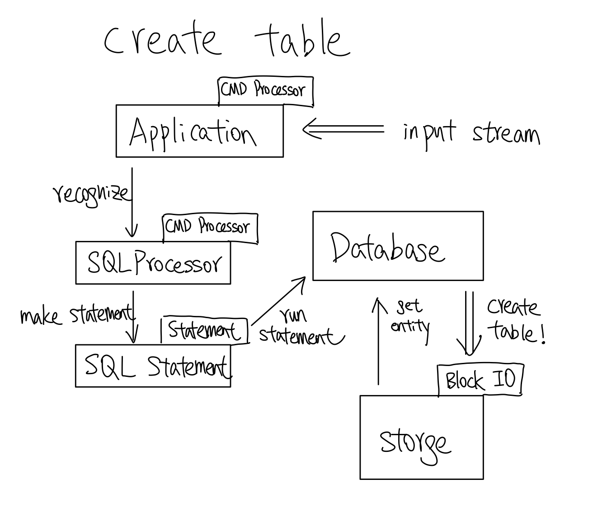
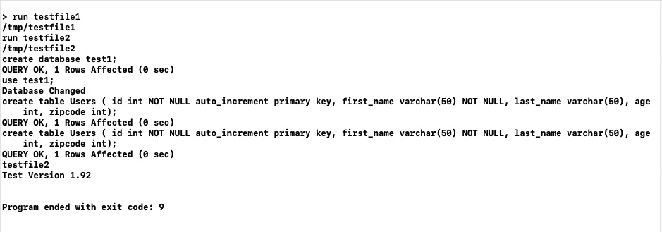

# SP22-Engineering-Notebook
# Jian Qin A15806136 ECE141B

1. what did you work on this week?
2. what did you learn from the assignment(s)?
3. what don't you understand/what questions do you have?

## Week 1 Update
In week 1, the most significant thing I learned is how tokenizer works and why it is important to convert raw texts in to symbols that the system can recognize.
I am pondering the exact definition of abstraction whose definition loosely relates to hiding details and indirection.
I learned key components of a database such as entities, languages, tables, interpreter, indexes, caching, etc.
In PA1, we implemented a few simple commands such as quit version and help. It gives me an overview of how the tokenizer system works.
In terms of future plan for the next week, I need to familiarize myself with the codebase and gain a deeper understanding of how each component of the system works.

## Week 2 Update
We learned about the strcuture of the storage system and how we can scale and add dimensions to it.
We discussed about different ways of serialization, encoding, and decoding. It is helpful to build our data model.
We reviewed lambda function which is very handy and useful.
We learned about what entities stand for and how we can use the concept in our database system.
In PA2, we extended the functionality of the tokenizer to read database commands. In addition, we implemented a basic level of BlockIO to read and write blocks of information.
The admin made a change to the Config file so the return type is consistently std::string to prevent unintended bugs.

## Week 3 Update

In week 3, I learned a lot about the design of the database, including how components communciate with each other and how each component does its job.
I figured that the command processor is not a controller itself, but rather a temporary objects that constructs a corresponding statement object that tells the correct controller what to do.
In our current implementation, the only two controller are application and database, and we will have three command processor: application, DBProcessor, and SQL Processor.
Another important thing we learned is how to parse effectively. The parsing diagram is very eye-opening and inspiring.

## Week 4 Update

In week 4, my understanding of the database is being reinforced. Our group is working hard on making the database more robust, such as using unique pointers, keep const keyword consistent, make more input validation, etc. We are really working hard to not only have a working database but a reliable and a robust database.
During class, I have learned and thought more about advanced parsing for the insert statement and select statement in the future. Reusability and system design are the core of our thinking now. We are working hard to not fall back to linear code, instead we are trying all sorts of ways to make our database readable and efficient.

## Week 5 Update
In week 5, we are delving more into retrieving and filtering data. In the filter class, we need to implement our expression class and evaluate logical expressions. We are also creating a query class which will handle the select statement. These additions make our system design better. Also we went through code better sessions to improve our code and avoid common mistakes like insufficient validation of results. Our group also makes the problem we cover in class so it was very helpful.

## Week 6 Update
In week 6, we are focusing on abstractions we have built in the database project. There are so many designs that remain timeless regardless how many features we are adding. For example, the recognize function is an abstraction. We can add more command processor to recognize more types of input commands, but the recognize function remains the same. The statement is also a abstraction parallel to the recognize function. Besides the most common functions we have talked about in class, Storable is a great abstraction. I have realized that by defining a set of shared attribtues, we can create great abstraction. Interface is more related to verbs, and inheritance is more related to structures. Interface gives flexbility because the verbs are the expressive actions. Inheritance gives great structure for abstraction to work coherently.

## Week 7 Update
In week 7, we are implementing delete rows, update rows, and drop table. To be honest these are very easy given what we have established in the select rows functionality. But I am really thinking hard about joins. Joins, indexes, and caching feel very challenging, so I am trying to get a head start at least on joins. I am thinking about how different parts of the system interact and what interface we need. In the first iteration, I want something really dumb and slow to work, kind of like select rows by brute force. It can be O(n^3), does not matter. Then we can substitute it with more efficient algorihtms, while keeping the same interface. For me, implementing something with brute force method while developing the interface for future improvement is very intuitive.

## Week 8 Update

In week 8, our team is working hard on the joins. We are thinking different ways we can make the joins efficient. But I will first talk about the side assignment given to us this week which is to run a script file. The idea is to add run_kw to a list of recognizable keywords by the application and it would search the file and use the stream as input for doScriptTest. By integrating into the database workflow directly, the benefit is that we can chain command calls across files. In the picture shown, I am running file1, and inside of file1, it is making a call to run file2. This makes the script testing very flexbile.

## Week 9 Update
In week9, we have more thoughts about a effective cache system and the implementation of an index system is taking most of our time. We are thinking about questions like which object should have the responsibilities to handle index and cache. where, what, why are the big questions we are asking ourselves. We continue to make our system more scalable and we always ask what would happen if there are a million records inserted.